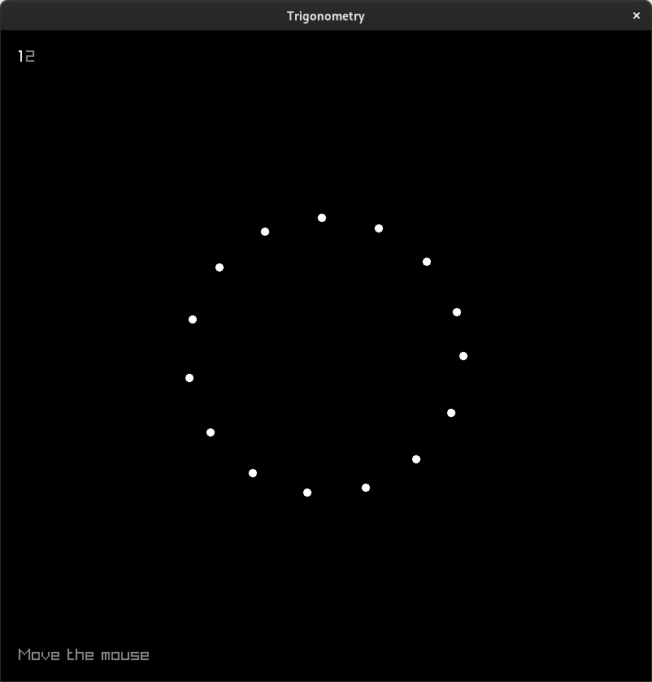

# Trigonometry visualizations in C with Raylib

## References
- https://github.com/raysan5/raylib
- https://www.mathsisfun.com/polar-cartesian-coordinates.html
- https://natureofcode.com/oscillation/#pointing-in-the-direction-of-movement
- https://www.youtube.com/watch?v=O5wjXoFrau4